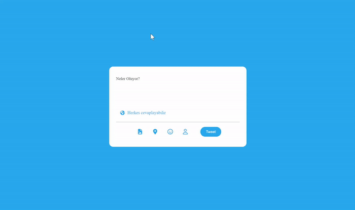

 
 <h1> Tweet Proje </h1>
  
  Bu proje, HTML, CSS ve JavaScript kullanılarak geliştirilen bir Twitter mesaj yazma panelini içerir. Kullanıcılar, 10 karakterlik bir sınırlama ile mesaj yazabilirler. Eğer sınır aşılırsa, yazılan metin kırmızı arka plan ile vurgulanır.

  <h3> Proje  Özellikleri </h3>
   
  
- 10 karakterlik sınırlama.
- Sınır aşıldığında uyarı gösterme.
- Karakterleri kırmızı arka plan ile vurgulama.

<h3>Kullanilan Teknolojiler </h3>
- Html
- Css 
- JavaScript
- Fontawesome

